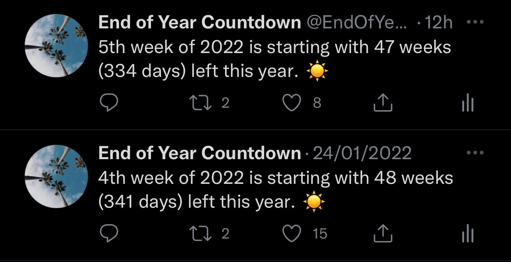

<h1 align="center">End of Year Countdown</h1>
 

<b>Twitter bot written in Python 🐍</b>

<b>Counting how many days and weeks there are left this year 📆</b>

<b>Running on <a href="https://twitter.com/EndOfYearCount">@EndOfYearCount</a> since February 1, 2020</b>

 

## 🦾 How does it work?
It starts by getting info like current date, month, year, which year is next and so on. Then it calculates how many days and weeks there are till the end of the year.

If current day is Monday, start of a week, it will make a tweet which week number is starting and how many days and weeks there are left this year.

Special tweets are set for New Year and Christmas. There were more tweets but were removed, so the bot did not tweet too often.

For communication with Twitter it is using a Python library [Tweepy](https://www.tweepy.org/), and for running the bot it is using Tasks on the [PythonAnywhere](https://www.pythonanywhere.com/) website, which allows you to set when you want to run your Python scripts.
