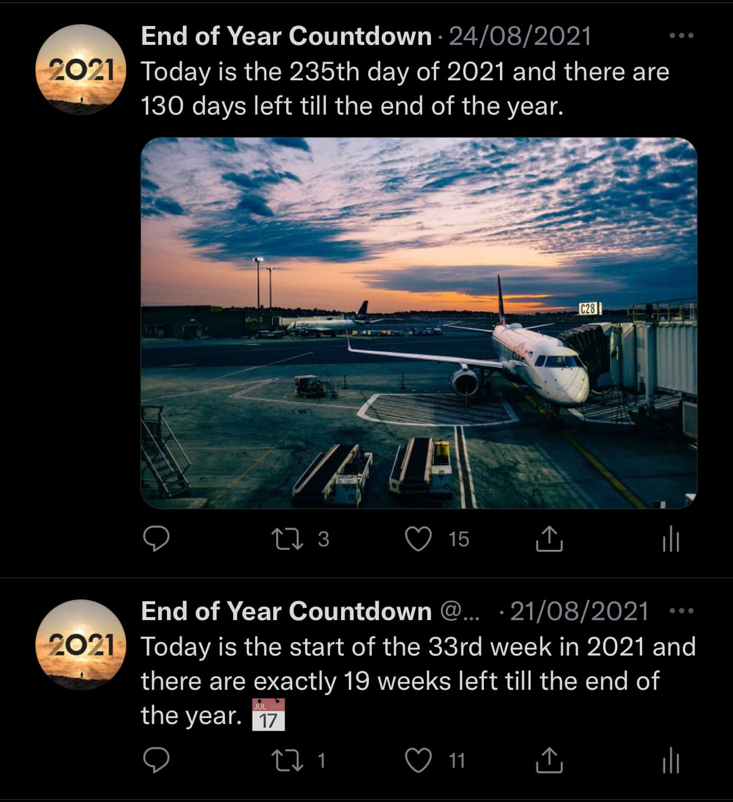

<h1 align="center">End of Year Countdown</h1>
 

<b>Twitter bot written in Python 🐍</b>

<b>Every day the bot checks how many days there are till the end of the year 📆</b>

<b>Running on Twitter account <a href="https://twitter.com/EndOfYearCount">@EndOfYearCount</a> since February 1, 2020</b>

 

## 🦾 How does the bot work?
At the start, it gets the current date, month, year, when does the year end, and which year is next. Then it calculates how many days there are till the end of the year. First, it checks if number of days can be evenly divided by 7. If yes, it will tweet how many full weeks there are till the end of the year.

If not, it will check if tweeting days is appropriate. Over the year it tweets every fifth day, so it does not tweet too often. In the month of December it starts tweeting every day. When tweeting days the bot will add which day of the year is it, and it will grab a random image from [Unsplash](https://unsplash.com/). There are special tweets set for the last and the first day of the year. On the first day of the year the bot will also update the profile picture to reflect a new year.

### How does the bot interact with Twitter?
The bot is using a Python library [Tweepy](https://www.tweepy.org/), which enables the communication between the bot and Twitter.

### Where does the bot run?
I am using a website called [PythonAnywhere](https://www.pythonanywhere.com/). PythonAnywhere has a feature called Tasks, which enables you to upload your Python code and set the time when you want to run it.
