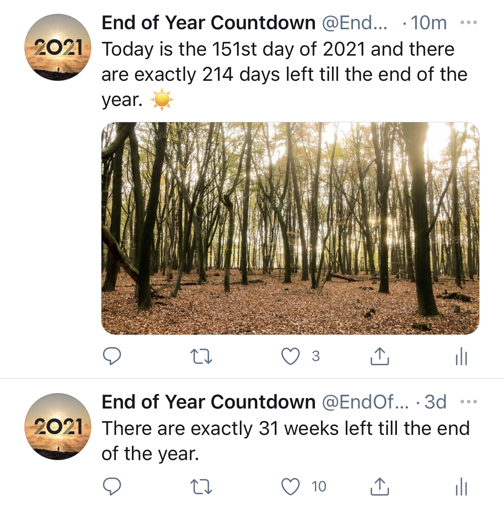

<h1 align="center">End of Year Countdown</h1>
 

<b>Twitter bot written in Python 🐍</b>

<b>Every day the bot checks how many days there are till the end of the year 📆</b>

<b>Running on Twitter account @EndOfYearCount since February 1, 2020</b>

 

## 🤖 How does the bot work?
When the code is run the bot saves the current date, year, when does the year end and which year is next. Then it calculates how many days there are till the end of the year. First, it checks if number of days can be evenly divided by 7. If yes, it will tweet how many full weeks there are till the end of the year. If not, it will check if tweeting days is appropriate. In the beginning the bot tweeted how many days there are left every single day, now over the year it tweets every fifth day, so it does not tweet too often. In month of December it starts tweeting again every day. Since version 7.0 the bot also tweets which day of the year is it alongside how many days there are till the end of the year. There are special tweets set for the last and the first day of the year. On the first day of the year the bot will also update the profile picture and description on Twitter to reflect a new year.

### How does the bot interact with Twitter?
The bot is using a Python library called __Tweepy__, which enables communication between Python code and Twitter API. You can find more about Tweepy on their [official page](https://www.tweepy.org/) or on their [GitHub repository](https://github.com/tweepy/tweepy).

### How does the bot run automatically every day?
Currently I am using a website called __PythonAnywhere__. PythonAnywhere has a feature called Tasks, which enables you to upload your Python code and set the time when you want to run it. You can find more about PythonAnywhere on their [official page](https://www.pythonanywhere.com/).

 

## 😇 Got any ideas?
The bot is often updated as new ideas appear. If you have also any ideas, feel free to message me.
